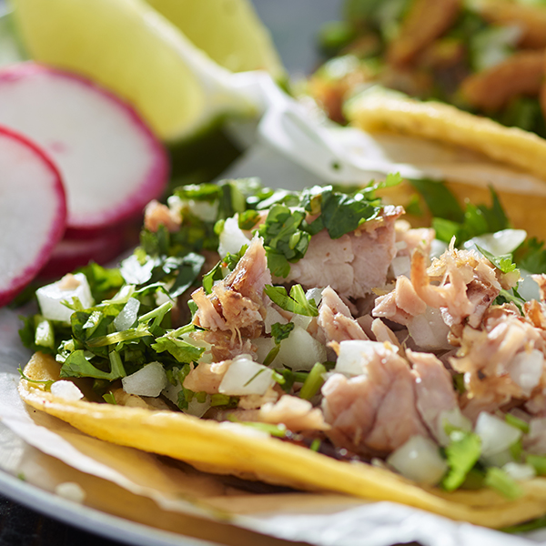

# 🌮 Origen de los Tacos

> *"En el principio, Dios creó los cielos, la tierra... y luego el taco al pastor."* — Nadie importante, pero debería.

---

## 📜 Breve historia no autorizada

Los tacos son una creación tan ancestral y sagrada como el fuego, o al menos eso dicen los expertos del antojo. Los primeros registros de algo que se parece a un taco provienen de civilizaciones mesoamericanas que envolvían comida en tortillas de maíz. ¿Por qué? Porque sabían lo que hacían.

> El taco no se inventó. El taco siempre ha sido. 🌌

---

## 🗺️ Posibles orígenes (según nadie confiable)

| Teoría                         | Evidencia histórica 🕵️ | Nivel de sabrosura 🌶️ |
|-------------------------------|-------------------------|------------------------|
| Aztecas + maíz + carne        | Altísima                | 🔥🔥🔥🔥🔥              |
| Alienígenas de Taconia Prime | Inexistente             | 🌶️🌶️🌶️🌶️              |
| Revolucionarios hambrientos  | Bastante plausible      | 🔥🔥🔥🔥                |

---

## 📷 Evidencia gráfica

> *Un taco carnívoro en su hábitat natural*

---

## 🧠 ¿Sabías qué...?

- El taco al pastor es una reinterpretación del shawarma libanés. 🇱🇧➡️🇲🇽
- El Día del Taco se celebra el **31 de marzo**. ¡Anótalo ya!
- En promedio, un mexicano puede comerse **5 tacos sin pestañear**.

---